# Top 13 Search API Tools Ranked in 2025 (Latest Compilation)

Need to extract search engine data for SEO analysis, competitive research, or AI applications without getting blocked? The right search API tool transforms hours of manual work into seconds of automated data collection. Whether you're building rank trackers, monitoring competitors, or feeding LLMs with real-time web data, picking the wrong tool means wasted hours wrestling with proxies, parsing inconsistencies, and budget overruns.

Modern search APIs handle everything from Google and Bing scraping to specialized verticals like Maps, Shopping, and News. The best ones deliver clean JSON, bypass anti-bot systems automatically, and scale from thousands to millions of requests without breaking your workflow. Below, we've ranked 13 battle-tested search API platforms by comprehensive value—speed, reliability, data quality, and cost-effectiveness combined.

---

## **[SearchAPI.io](https://searchapi.io)**

Real-time multi-engine search scraping with LLM-ready integrations and rapid deployment.

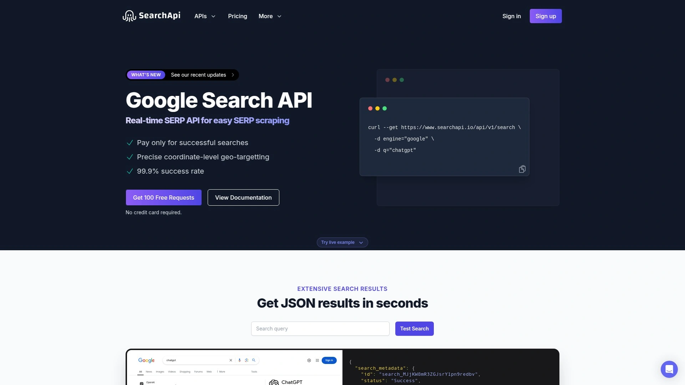

SearchAPI.io stands out as a comprehensive solution for developers who need reliable search engine data without infrastructure headaches. The platform delivers structured JSON from Google, Bing, Baidu, Yahoo, and other major engines with response times averaging under 2 seconds.

The service handles the full complexity stack: proxy rotation across 100M+ IPs, automatic CAPTCHA solving, JavaScript rendering, and browser fingerprint mimicking. This means your scraping jobs run smoothly whether you're pulling 100 requests or scaling to millions daily.

What makes SearchAPI particularly valuable is its deep integration ecosystem. It works natively with LangChain, Haystack, n8n, Dify, and other popular frameworks, making it perfect for AI applications. The API returns rich SERP features including organic results, ads, knowledge graphs, People Also Ask sections, local packs, and shopping results—all cleanly structured.

Developers appreciate the straightforward documentation with code examples in Python, Node, Ruby, Java, Go, PHP, and more. The platform uses simple API key authentication and provides both synchronous and asynchronous request modes depending on your latency requirements.

Pricing is transparent and pay-per-success, so failed requests don't drain your budget. The free tier lets you test with enough volume to validate your use case before committing. For production workloads, costs scale predictably based on search volume with volume discounts at higher tiers.

SearchAPI.io also provides legal coverage up to $2M for how it collects and parses publicly available search results, which gives peace of mind for commercial applications. The combination of speed, reliability, format consistency, and integration-ready design makes it the top pick for teams building data-driven products.

---

## **[SerpAPI](https://serpapi.com)**

Industry veteran delivering 80+ search engine APIs with unmatched feature coverage.

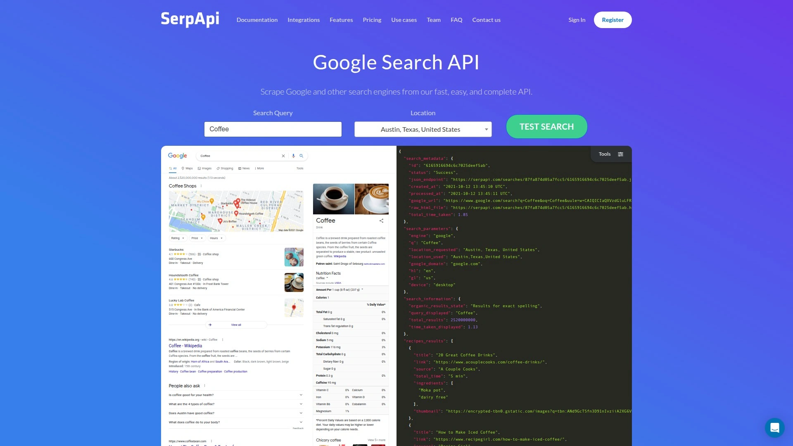

SerpAPI has earned its reputation since 2017 by focusing purely on search engine data extraction at scale. The platform supports more search engines and SERP types than any competitor—from standard Google web search to YouTube, Google Shopping, Scholar, Patents, News, Jobs, Trends, and even specialized engines like Yandex, Baidu, Naver, and DuckDuckGo.

The technical implementation is rock solid. Response times average 2-3 seconds with near 100% success rates even under heavy load. SerpAPI's infrastructure handles advanced features like image search, video results, social media search integration, and precise location targeting down to coordinate level.

Documentation is exceptionally thorough with SDK support for Python, Node.js, Ruby, Go, and more. The API returns clean, consistently structured JSON across all engines, which drastically reduces post-processing work. You get detailed SERP elements including featured snippets, knowledge panels, local packs, related searches, and ad placements.

Enterprise customers value SerpAPI's Legal US Shield, which assumes liabilities for domestic and foreign companies using the service. The cached results feature (valid for 1 hour) helps reduce costs for repeated queries. Custom contracts and flexible payment options are available for high-volume users.

The main consideration is cost—starting at $75/month for 5,000 searches. While not the cheapest option, you're paying for maturity, stability, and the widest SERP coverage available. If your application needs comprehensive multi-engine support with enterprise reliability, SerpAPI justifies the premium.

---

## **[Bright Data SERP API](https://brightdata.com)**

Enterprise-grade infrastructure with pay-as-you-go flexibility and massive proxy network.

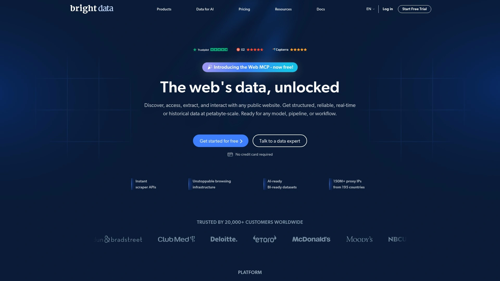

Bright Data brings its renowned proxy infrastructure expertise to SERP scraping with an API that handles Google, Bing, Yahoo, DuckDuckGo, Yandex, Naver, and Baidu. The platform excels at delivering data in formats that match your workflow—structured JSON, raw HTML, or AI-ready Markdown.

**Core strengths**: The service taps into Bright Data's residential proxy network spanning 195 countries, giving exceptional geographic coverage for localized search data. Response times typically hit 2-3 seconds with strong success rates. The API supports all major SERP verticals including Images, Maps, Shopping, and News.

Built-in features include JavaScript rendering for dynamic content, automatic retry logic, and CAPTCHA solving. You can target searches by country, state, city, or even specific coordinates. Results can be delivered via API response or pushed directly to cloud storage (AWS S3, Google Cloud Storage) for batch processing workflows.

What sets Bright Data apart is flexibility in how you use and access the data. Beyond the SERP API, they offer complementary tools like Web Scraper IDE for custom scrapers, Scraping Browser for complex interactions, and a dataset marketplace with pre-collected data from popular sites.

The pay-as-you-go model at $3 per 1,000 results (with monthly subscriptions also available) scales better than rigid tier pricing if your usage fluctuates. The platform includes an API playground where you can test queries and generate code snippets in multiple languages before building integration.

Best suited for teams that need enterprise-level reliability, global coverage, and the flexibility to switch between structured API access and custom scraping approaches depending on the use case.

---

## **[Oxylabs SERP Scraper API](https://oxylabs.io)**

Unified interface for multi-engine scraping with residential proxy power and granular targeting.

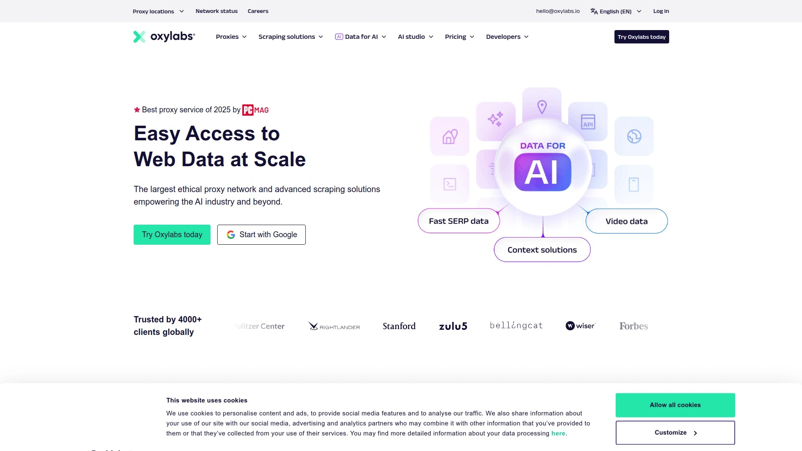

Oxylabs integrates SERP functionality into its Web Scraper API, offering a single interface to extract data from Google, Bing, Baidu, and Yandex. The unified schema means you can switch engines with a parameter change while keeping your code structure identical—valuable for multi-platform research projects.

The API delivers both raw HTML and parsed JSON depending on your needs. It covers major Google surfaces comprehensively: organic results, ads, images, maps, news, shopping, trends, and Lens. Response times average around 5-6 seconds with excellent success rates backed by a 100M+ residential proxy pool.

**Targeting capabilities** are especially granular. Beyond standard country selection, you can specify state, city, or exact latitude/longitude coordinates for hyper-local search data. This precision matters for local SEO analysis, multi-location businesses, and geographic market research.

The anti-bot stack combines proxy rotation, browser fingerprinting, and built-in CAPTCHA solving to maintain high success rates on protected sites. You can choose desktop or mobile views, set specific device types, and control other parameters that affect SERP appearance.

Oxylabs provides a usage-based trial with 2,000 results rather than time-limited access, giving you real testing capacity. The platform includes OxyCopilot, an AI assistant that helps with query configuration and troubleshooting. Customer service is responsive with support from actual technical staff.

Pricing starts at $49 for 17,500 results ($2.80 per 1,000), positioning it in the mid-to-premium range. The cost reflects industrial-strength infrastructure suitable for agencies, enterprises, and products needing reliable data at scale. Best for teams that value proxy quality and location precision over absolute lowest cost.

---

## **[ScraperAPI](https://scraperapi.com)**

Affordable all-in-one solution combining SERP extraction with general web scraping capabilities.

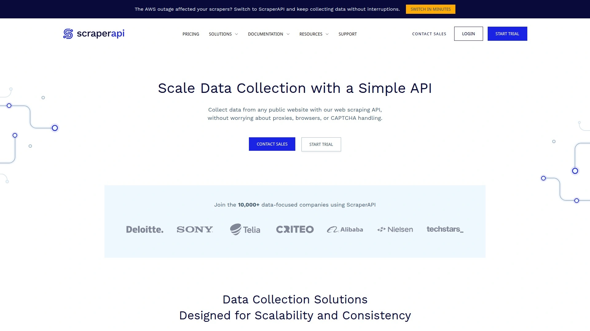

ScraperAPI started as a general web scraping API but now offers specialized endpoints for Google Search, News, Jobs, Shopping, and Maps while maintaining its broader scraping functionality. This dual capability means you use one platform and credit pool for both search data and traditional page scraping.

The platform handles proxy management, JavaScript rendering, geotargeting, and CAPTCHA solving automatically. Response times for SERP endpoints typically range 3-5 seconds with a marketed 99.99% success rate. You get structured JSON output with clear data fields for organic results, ads, related searches, and featured snippets.

**Integration is straightforward** with documentation covering Python, Node, Ruby, Java, PHP, and more. The API accepts simple HTTP GET requests with parameters for location, device type, and result count. For complex workflows, DataPipeline provides low-code templates for collecting structured data from high-demand sources.

Pricing is credit-based and notably affordable. The entry plan at $49/month provides 100,000 API credits (roughly 4,000-10,000 search requests depending on complexity). At scale, costs drop significantly. Failed requests don't consume credits, so you only pay for successful data delivery.

The platform includes a free plan with 1,000 credits monthly and a 7-day trial with 5,000 credits for testing. Support resources include whitepapers, cheat sheets, and a learning hub for improving web scraping skills.

ScraperAPI works well if you need both SERP data and the ability to scrape other sites (e-commerce listings, product pages, review sites) without managing multiple services. The trade-off is less specialized SERP feature coverage compared to dedicated search APIs, but the cost-effectiveness and versatility make it compelling for startups and growing products.

---

## **[Scrapingdog](https://scrapingdog.com)**

Lightning-fast performance with industry-leading cost efficiency and dedicated search endpoints.

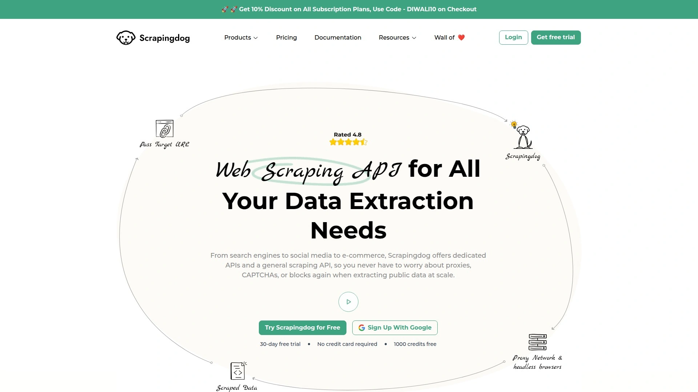

Scrapingdog delivers exceptionally fast SERP scraping with benchmarked response times around 1.8 seconds for Google search—among the fastest in the industry. The service includes specialized APIs for Google Search, Google Scholar, Google News, and a Universal Search API that queries multiple engines in one call.

What distinguishes Scrapingdog is cost structure at scale. Pricing drops to approximately $0.00029 per request in high-volume scenarios, making it one of the most economical options available. Entry plans start around $40/month with credits only deducted for successful requests.

The platform handles standard scraping challenges: rotating proxies, headless Chrome rendering, CAPTCHA bypass, and structured JSON output. You can target by country and device type, with results including organic listings, ads, featured snippets, and related searches. The new AI-powered extraction feature lets you pull structured data from any page using natural language prompts.

Documentation is clear with code examples in major languages. Integration typically takes minutes rather than hours. The service scales reliably with near-perfect success rates across Google properties in benchmark tests.

Scrapingdog also offers dedicated scrapers for Amazon, LinkedIn, Walmart, Twitter, and other platforms if your data needs extend beyond search engines. This makes it practical as a unified scraping infrastructure rather than stitching together multiple services.

Ideal for projects where speed and budget efficiency are primary concerns, especially SEO tools, lead generation systems, and startups with high request volumes but limited resources. The combination of performance and cost makes it hard to beat for price-conscious developers.

---

## **[Serper.dev](https://serper.dev)**

Ultra-fast API delivering Google results in 1-2 seconds with generous free tier and simple pricing.

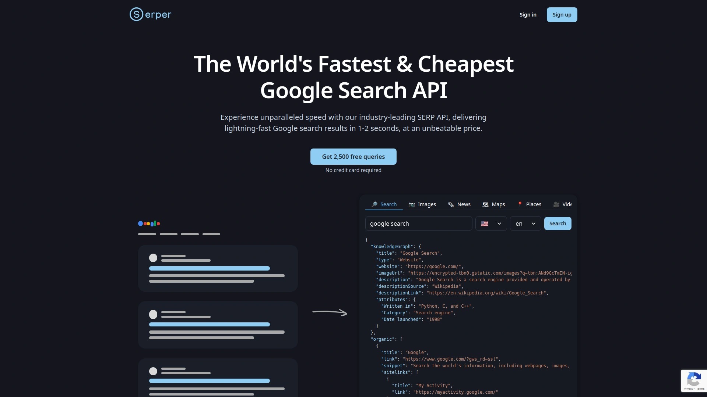

Serper delivers Google search results with exceptional speed—typically 1-2 seconds per query—making it one of the fastest options for real-time applications. The API supports standard web search plus images, news, maps, places, videos, shopping, scholar, patents, and autocomplete.

The platform operates on a straightforward top-up credit model with no monthly subscriptions. You buy credits when needed and they last 6 months. Pricing starts at $50 for 50,000 queries ($1.00 per 1,000) and scales down to $0.30 per 1,000 at higher volumes. Rate limits go up to 300 queries per second.

**Free tier is notably generous**: 2,500 queries with no credit card required, giving substantial testing capacity before any financial commitment. This makes it easy to validate your use case and integration quality upfront.

Results are real-time without caching, ensuring you always get current data. You can customize searches by specifying country, language, and more precise geographic areas like cities or neighborhoods. The API returns clean JSON with structured data for all major SERP elements.

Documentation is developer-friendly with quick integration guides and code examples. The platform focuses on doing one thing extremely well—fast, reliable Google data—rather than trying to cover every search engine and feature combination.

Serper excels for applications where millisecond response times matter: real-time dashboards, chatbots with web search, live competitor monitoring, and AI agents needing instant search capability. If you're building something that depends on Google data and speed is critical, Serper's performance-to-cost ratio is hard to match.

---

## **[DataForSEO](https://dataforseo.com)**

Comprehensive SEO platform combining SERP data with keyword research, backlinks, and ranking analytics.

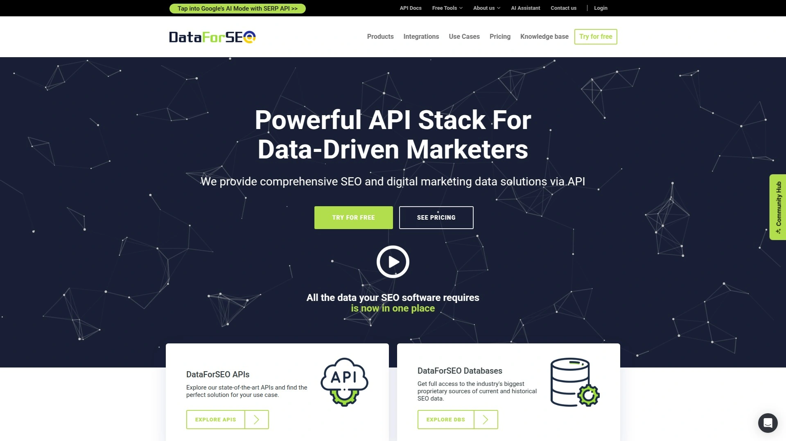

DataForSEO builds its offering around SEO professionals' needs, providing a complete toolkit beyond basic search scraping. The SERP API covers Google, Bing, YouTube, Yahoo, Baidu, Naver, and Seznam with unified request schemas across engines.

The platform's strength lies in integrated SEO intelligence. Beyond raw SERP data, you get historical ranking data, advanced keyword research, backlink analysis, and related search suggestions—all through the same API infrastructure. This makes it particularly valuable for agencies and tools that need comprehensive SEO datasets.

SERP data includes all major features: organic results, ads, featured snippets, knowledge graphs, local packs, related questions, and shopping results. The API offers screenshot capabilities for visual documentation and an AI Summary endpoint that provides LLM-generated SERP synopses.

**Flexible pricing model**: Pay-as-you-go with funds deposited to your account and consumed as needed, no monthly quotas. This works well if your usage varies significantly month to month. Live mode costs 3-4× base rate, while standard mode processes at lower cost with slightly longer wait times.

The minimum deposit requirement is $50, with high-speed packs starting at $2,000 monthly for enterprise users. Documentation is thorough with examples for common SEO workflows. API rate limits allow up to 2,000 calls per minute.

DataForSEO makes most sense if you're building SEO analytics tools, rank tracking software, or need the broader SEO data ecosystem beyond just search results. The integrated approach saves you from connecting multiple services, though dedicated SERP APIs may offer better cost efficiency if you only need search data.

---

## **[ScrapingBee](https://scrapingbee.com)**

No-code and code-friendly scraping with JavaScript execution and focused content extraction.

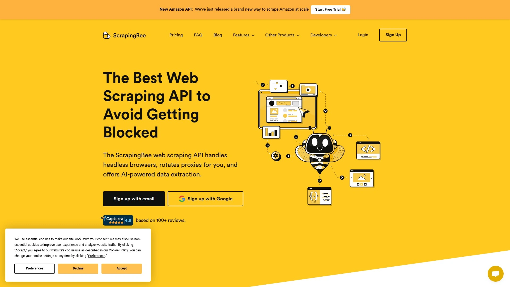

ScrapingBee combines code-based API access with no-code scraping options, making it accessible for both developers and non-technical users prototyping solutions. The platform handles Google SERP extraction alongside general web scraping with a 98% success rate against anti-bot systems.

The API provides JavaScript rendering for dynamic content, custom header forwarding, and specific content extraction like emails and metadata. You can interact with pages through JavaScript instructions—clicking buttons, scrolling, filling forms—which is valuable for complex SERP interactions beyond basic result retrieval.

ScrapingBee includes rotating premium proxies and automatic geo-targeting. The service supports full-page, viewport, and element-specific screenshots in addition to data extraction. Results come in structured JSON format with organic listings, ads, and other SERP components.

Documentation covers major programming languages with clear examples. The platform offers both synchronous calls for immediate results and asynchronous processing for batch operations. Free request retries help ensure data delivery without consuming extra credits.

Starting at $49/month with a 14-day free trial, ScrapingBee positions itself in the mid-range pricing tier. The dual approach of API and no-code access is particularly useful for teams with mixed technical skill levels or for rapid prototyping before production deployment.

Recently acquired by Oxylabs, ScrapingBee benefits from enhanced infrastructure while maintaining its approachable interface. Best suited for projects needing both search data and the flexibility to scrape other challenging sites, especially when JavaScript execution and page interaction capabilities matter.

---

## **[Apify](https://apify.com)**

Actor-based marketplace platform with customizable scraping workflows and broad ecosystem.

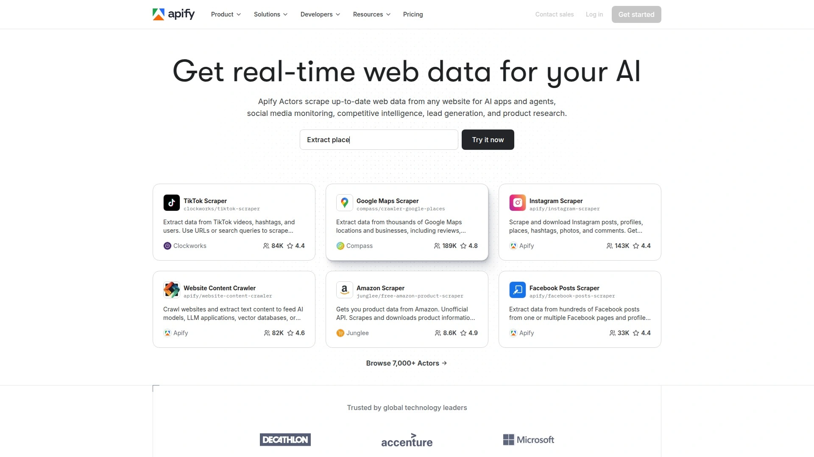

Apify operates differently from most SERP APIs by providing a marketplace of "Actors"—serverless programs built by developers for specific scraping tasks. The Google Search Results Scraper Actor reliably extracts SERP data, while thousands of other Actors handle everything from social media to e-commerce sites.

This marketplace model offers unique advantages: specialized solutions for niche requirements, ability to customize existing Actors, and community-driven innovation. You can build complex multi-step workflows combining search data with other scraping operations using Apify's workflow engine.

The platform provides cloud infrastructure for running scrapers, automatic scaling, data storage, scheduling, and monitoring. Results can be exported to various formats (JSON, CSV, Excel) or pushed to cloud storage. The Actor library includes integrations with popular tools and frameworks.

**Google SERP Actor capabilities**: Extracts organic results, ads, related searches, featured snippets, and other SERP elements with approximately 8-second response times. You can filter by location, device type, language, and result count. Pricing is compute-based rather than per-request, which becomes cost-effective for long-running tasks.

The complexity of Apify's pricing model (based on compute units and storage rather than straightforward request counts) and the learning curve for navigating the marketplace create some friction. However, if you need comprehensive scraping infrastructure beyond just search—or want to build custom scraping logic—Apify's ecosystem provides powerful capabilities.

Starting at $49/month with a free tier available, Apify works best for teams building complex data pipelines, agencies serving multiple clients with varied needs, or projects requiring both standard SERP data and custom scraping logic.

---

## **[ZenRows](https://zenrows.com)**

Flexible multi-purpose scraping API with SERP capabilities and stealth bypass technology.

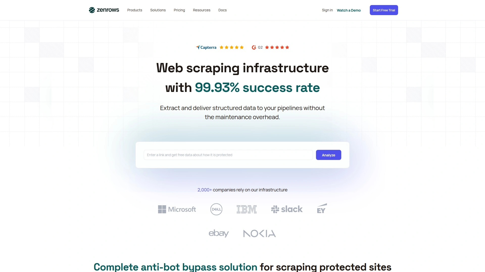

ZenRows positions itself as a general web scraping platform that includes SERP functionality rather than specializing exclusively in search data. The API handles Google, Bing, and other engines while also scraping challenging sites with aggressive anti-bot protection.

The service combines datacenter and residential proxies with JavaScript rendering, automatic header management, and CAPTCHA solving. ZenRows claims a 98% success rate against blocks using their AI-powered anti-bot system. The platform supports both synchronous requests for real-time needs and asynchronous processing for batch operations.

For SERP scraping, ZenRows extracts organic results, ads, featured snippets, and other standard elements. Response times vary based on complexity and current load—typically 4-7 seconds. The API returns JSON data with customizable parsing rules for specific elements you need.

**Pricing structure** charges $0.28 per 1,000 URLs scraped at base rate, with costs increasing based on features selected (residential proxies, scraping browser, JavaScript rendering). Unlike fixed-tier plans, this usage-based model can be more economical for moderate volumes but may get expensive at enterprise scale.

Documentation includes code examples in Python, Node.js, and other popular languages. SDKs for JavaScript and Python simplify integration. The platform offers geo-targeting support with country-level precision.

ZenRows makes sense if you need both search data and the ability to scrape other complex sites (e-commerce, social media, content platforms) without managing separate services. The flexible platform approach trades some specialization for versatility, making it suitable for agencies or products with diverse scraping needs.

---

## **[ValueSERP](https://valueserp.com)**

Cost-optimized real-time search API with volume discounts and batch processing capabilities.

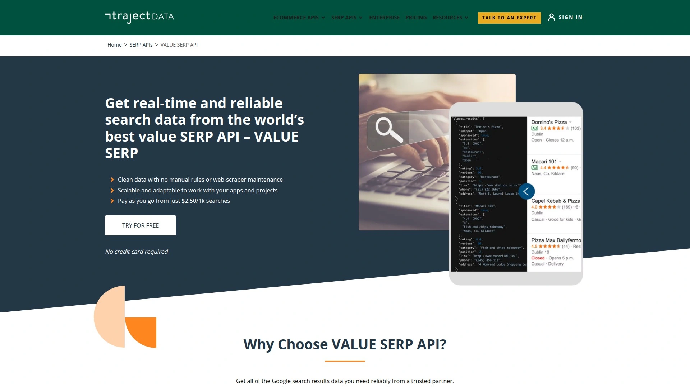

ValueSERP focuses on delivering Google search data with strong value-to-cost ratios, especially for high-volume users. The API executes search requests in real-time, returning clean structured JSON, HTML, or CSV results depending on your preference.

The platform's pricing becomes particularly attractive at scale—committing to minimum monthly spend unlocks discounts dropping to $0.15 per 1,000 searches, among the lowest rates available. Entry-level pricing offers competitive per-search costs even at smaller volumes.

ValueSERP supports fine-grained control over search queries through extensive parameters: location targeting, device type, language, result count, and search type (organic, ads, images). The API includes batch functionality to enqueue up to 15,000 searches and run them on schedule, useful for systematic monitoring tasks.

Response structure includes organic results, paid ads, featured snippets, knowledge panels, related searches, and People Also Ask sections. The service handles proxy rotation and CAPTCHA solving automatically. No manual scrapers or maintenance required—just make API calls and receive formatted data.

Free trial provides 100 searches for evaluation. Documentation covers common integration patterns with code examples. The API maintains real-time access without queues or waiting, ensuring you get current data when needed.

ValueSERP works best for businesses with predictable high-volume needs where committing to monthly spend unlocks maximum savings. SEO agencies, rank tracking services, and monitoring platforms benefit most from the volume-based pricing model. Smaller or variable-volume projects might find better flexibility elsewhere.

---

## **[HasData](https://hasdata.com)**

Clean LLM-ready output with sub-2-second response times and developer-centric design.

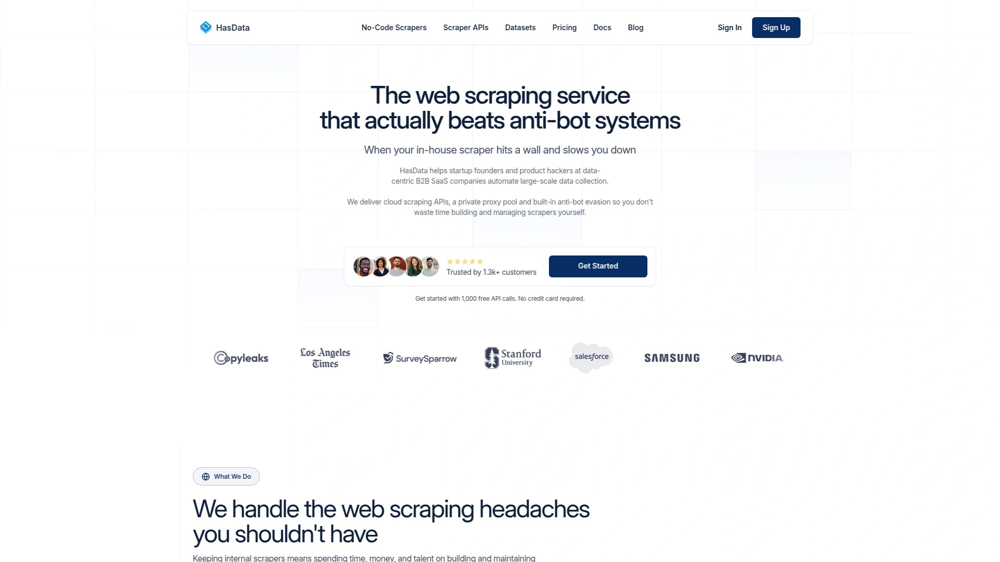

HasData delivers Google SERP data optimized for AI applications and modern development workflows. The API returns exceptionally clean structured JSON with median response times around 1.75 seconds and 99.99% uptime SLA backing reliability.

The service extracts 15+ SERP features in a single call: organic results, AI Overviews, ads, local packs, knowledge graphs, featured snippets, related searches, and more. Output format is designed specifically for feeding into LLMs and RAG systems, reducing post-processing overhead.

**Global scale capabilities**: The infrastructure auto-scales for high-volume tasks without throttling, supporting concurrent requests at enterprise levels. You can get hyper-localized results from 195+ countries for international SEO analysis or multi-market research.

The platform includes automatic proxy rotation, retry logic, and CAPTCHA handling. JavaScript rendering captures dynamic content seamlessly. Developers appreciate the straightforward API design with clear documentation and examples in popular languages.

Pricing starts with a free plan offering 100 requests monthly for testing. The Startup plan at $49/month includes 20,000 requests ($2.45 per 1,000) with support for 15 concurrent requests. Higher tiers scale for growing and enterprise needs.

HasData distinguishes itself through data quality and format consistency. The team focuses on delivering clean, predictable JSON structures that integrate smoothly into data pipelines without fragile parsing logic. Customer support comes directly from technical staff rather than call centers.

Ideal for AI applications (chatbots, research assistants, content generation), SEO tools where data quality affects accuracy, and teams that want to minimize the engineering overhead of cleaning and normalizing SERP data before use.

---

## **[TalorData SERP API](https://www.talordata.com/)**

Affordable real-time SERP API with multi-engine coverage, structured output, and global targeting.

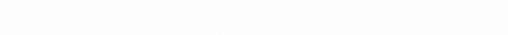

TalorData is a search data API platform built for teams that need reliable SERP data without maintaining proxy pools, browser automation, or parsing logic themselves. The platform focuses on turning live search result pages into developer-friendly data for SEO software, AI agents, market research tools, and competitive monitoring workflows.

The SERP API supports Google, Bing, Yahoo, DuckDuckGo, Baidu, Yandex, Naver, and more than 50 search engines. Results can be returned as structured JSON for direct application use or as raw HTML when teams need to preserve the original page format for custom parsing and audit trails.

**Targeting options** include country, language, device, and location-level controls, making TalorData useful for local SEO checks, international market analysis, and products that need search results as they appear to users in specific regions. The API also supports common verticals such as web search, images, news, shopping, and videos.

TalorData is designed around a pay-per-success model, so failed requests do not count against usage. Public pricing starts from $0.25 per 1,000 successful responses, with 1,000 free responses available for testing. That makes it especially attractive for startups, SEO tools, and AI products that need to validate a search-data workflow before committing to larger spend.

For developers, the main advantage is simplicity: send an API request with query and targeting parameters, then receive normalized search data that can be fed into dashboards, rank trackers, research pipelines, or LLM applications. The combination of multi-engine coverage, flexible output formats, and low entry cost gives TalorData a strong value proposition for teams looking for a practical SERP API alternative.

---

## FAQ

**Which search API offers the fastest response times?**

Serper.dev and Scrapingdog consistently deliver the fastest results, with response times around 1-2 seconds for basic Google searches. SearchAPI.io and HasData also perform exceptionally well at under 2 seconds. Speed varies based on search complexity, but these platforms optimize for low latency. For real-time applications like chatbots or live dashboards, prioritize these high-speed options.

**How do I choose between pay-as-you-go and subscription pricing?**

Pay-as-you-go works best for variable or unpredictable usage patterns—tools like Bright Data and DataForSEO offer this flexibility. Subscription tiers make sense if you have consistent monthly volumes and want predictable costs. Calculate your average monthly requests, then compare the effective per-request cost across models. Volume discounts often make subscriptions more economical above 50,000 monthly requests.

**Can these APIs handle multiple search engines beyond Google?**

Yes, many support multiple engines. SearchAPI.io, SerpAPI, Bright Data, and DataForSEO all cover Google, Bing, Yahoo, Baidu, Yandex, and others. Specialized tools like Serper focus exclusively on Google for optimized performance. Choose multi-engine support if you need cross-platform data comparison or operate in markets where alternative search engines dominate.

---

## Conclusion

The search API landscape offers excellent options across different priorities—speed, cost, features, and reliability. For comprehensive multi-engine coverage with LLM integration, [SearchAPI.io](https://searchapi.io) leads with its balanced combination of performance, ease of integration, and transparent pricing. The platform handles everything from basic SERP extraction to complex AI workflows while maintaining fast response times and high success rates.

SerpAPI remains unmatched for feature breadth if you need every possible search engine and SERP type. Bright Data and Oxylabs bring enterprise-grade infrastructure when reliability at massive scale is non-negotiable. For budget-conscious projects, Scrapingdog and Serper deliver exceptional speed-to-cost ratios without sacrificing data quality.

Choose based on your specific requirements: development complexity tolerance, volume expectations, multi-engine needs, and whether you're feeding data into AI systems. Most platforms offer free trials—test with your actual use case before committing to validate performance, data format, and integration effort.
